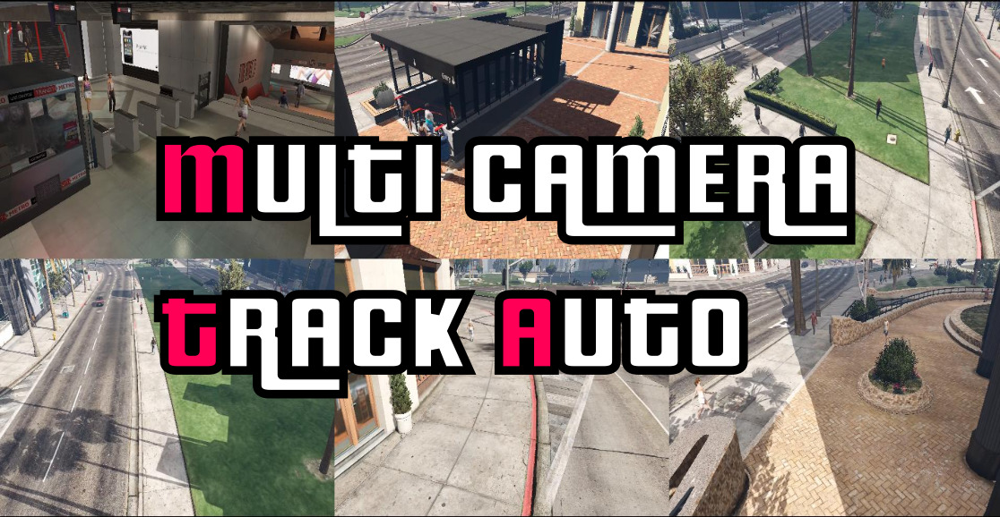

# The MTA Dataset




The **MTA** (Multi Camera Track Auto) is a large multi target multi camera tracking dataset. It
contains over 2,800 person identities, 6 cameras and a video 
length of over 100 minutes per camera.


## Getting the dataset

To obtain the Dataset, you first need the **MTA-Download-URLs**, 
so please send an email (to be determined) [philipp.koehl@gmail.com](mailto:philipp.koehl@gmail.com) 
 (with object "MTA Dataset Download") stating:

- Your name, title and affilation

- Your intended use of the data

The following statement:
```text
With this email we declare that we will use the MTA Dataset 
for research and educational purposes only, since we are aware that 
commercial use is prohibited. We also undertake to purchase a copy of Grand Theft Auto V.
```

We will send you the **MTA-Download-URLs**  as fast as possible
 that you can use to download the following files:

#### Multi person multi camera tracking

**MTA_videos.zip**  
- Contains 12 videos (train and test videos for 6 cameras)    
and **multi camera tracking annotations** (frame number, person id, bounding box).  
- 41GB zipped and 42GB unzipped  
- Overall video length: 102min

**MTA_videos_coords.zip**  
- Full annotations e.g. body joints
- 28.6GB zipped and 235GB unzipped.  

**MTA_ext_short.zip**  
- Extracted short part of MTA_videos (videos and annotations)
- 1.7GB zipped and 1.8GB unzipped
- Overall video length: 4min

**MTA_ext_short_coords.zip**  
- Full annotations of the extracted short part
- 1.1GB zipped and 8.9GB unzipped  

#### Person re-identification

**MTA_reid.zip**
- Re-id dataset based on the MTA_videos
- 0.8GB zipped and 1.2GB unzipped


## Contents

#### Multi person multi camera tracking

**MTA_{videos,ext_short}.zip**
- 6 train and 6 test set camera videos
    - `MTA_{videos,ext_short}/{train,test}/cam_{0-5}/cam_{0-5}.mp4`
- 6 train and 6 test set camera tracking annotation csv files
    - `MTA_{videos,ext_short}/{train,test}/cam_{0-5}/coords_fib_cam_{0-5}.csv`

**MTA_{videos,ext_short}_coords.zip**

- 6 train and 6 test set camera full annotation csv files
    - `MTA_{videos,ext_short}_coords/{train,test}/cam_{0-5}/coords_cam_{0-5}.csv`

#### Person re-identification

**MTA_reid.zip**
- 72301 images in re-id train set  
15165 images in the re-id query set    
60448 images in the re-id test set 
    - `MTA_reid/{train,query,test}/framegta_{int}_camid_{0-5}_pid_{int}.png`
- 36100 overall excluded distractor images which don't show enough to recognize a person
    - `MTA_reid/distractors/{train,query,test}/framegta_{int}_camid_{0-5}_pid_{int}.png`


## Annotations

#### Multi person multi camera tracking

##### Annotations in `coords_fib_cam_{0-5}.csv`

| column name       | Description                             | 
|-------------------|-----------------------------------------| 
| frame_no_cam      | frame number per camera starting from 0 | 
| person_id         | person id                               | 
| x_top_left_BB     | x top left bounding box coordinate      | 
| y_top_left_BB     | y top left bounding box coordinate      | 
| x_bottom_right_BB | x bottom right bounding box coordinate  | 
| y_bottom_right_BB | y bottom right bounding box coordinate  | 


##### Annotations in `coords_cam_{0-5}.csv`

| column name         | Description                                          | 
|---------------------|------------------------------------------------------| 
| frame_no_gta        | ingame native frame number                           | 
| frame_no_cam        | frame number per camera starting from 0              | 
| person_id           | person id                                            | 
| appearance_id       | allows to recreate a person with the same appearance | 
| joint_type          | joint type                                           | 
| x_2D_joint          | x 2D joint position                                  | 
| y_2D_joint          | y 2D joint position                                  | 
| x_3D_joint          | x 3D joint position                                  | 
| y_3D_joint          | y 3D joint position                                  | 
| z_3D_joint          | z 3D joint position                                  | 
| joint_occluded      | 1 if the joint is occluded; 0 otherwise              | 
| joint_self_occluded | 1 if the joint is occluded by its owner; 0 otherwise | 
| x_3D_cam            | x 3D camera position                                 | 
| y_3D_cam            | y 3D camera position                                 | 
| z_3D_cam            | z 3D camera position                                 | 
| x_rot_cam           | x camera rotation                                    | 
| y_rot_cam           | y camera rotation                                    | 
| z_rot_cam           | z camera rotation                                    | 
| fov                 | camera field of view                                 | 
| x_3D_person         | x 3D person position                                 | 
| y_3D_person         | y 3D person position                                 | 
| z_3D_person         | z 3D person position                                 | 
| x_2D_person         | x 2D person position                                 | 
| y_2D_person         | y 2D person position                                 | 
| ped_type            | pedestrian type                                      | 
| wears_glasses       | 1 if the person is wearing glasses; 0 otherwise      | 
| yaw_person          | person yaw                                           | 
| hours_gta           | ingame time hours                                    | 
| minutes_gta         | ingame time minutes                                  | 
| seconds_gta         | ingame time seconds                                  | 
| x_top_left_BB       | x top left bounding box coordinate                   | 
| y_top_left_BB       | y top left bounding box coordinate                   | 
| x_bottom_right_BB   | x bottom right bounding box coordinate               | 
| y_bottom_right_BB   | y bottom right bounding box coordinate               | 

Note that the camera 3D coordinates are in the GTA 3D coordinate system.

**Pedestrian types**

| ped_type |  Description                 | 
|----------|------------------------------| 
| 0        |  Player character Michael    | 
| 1        |  Player character Franklin   | 
| 2        |  Player character Trevor     | 
| 29       |  Army                        | 
| 28       |  Animal                      | 
| 27       |  SWAT                        | 
| 21       |  Los Santos Fire Department  | 
| 20       |  Paramedic                   | 
| 6        |  Cop                         | 
| 4        |  Male                        | 
| 5        |  Female                      | 
| 26       |  Human                       | 

Source: http://www.dev-c.com/nativedb/

**Joint type**

```
 0: head_top
 1: head_center
 2: neck
 3: right_clavicle
 4: right_shoulder
 5: right_elbow
 6: right_wrist
 7: left_clavicle
 8: left_shoulder
 9: left_elbow
10: left_wrist
11: spine0
12: spine1
13: spine2
14: spine3
15: spine4
16: right_hip
17: right_knee
18: right_ankle
19: left_hip
20: left_knee
21: left_ankle
```

#### Person re-identification

The annotations are encoded in the image filenames using the following format:  
- `{annotation_name}_{value}`.  

As the image filename goes as follows:   
- `framegta_{int}_camid_{0-5}_pid_{int}.png`  

The following annotations are available:
 
| annotation name | description                          | 
|-----------------|--------------------------------------| 
| framegta        | ingame frame number aka frame_no_gta | 
| camid           | camera id aka cam_id                 | 
| pid             | person id aka person_id              | 

These annotations come from the multi person multi camera tracking annotations in `coords_cam_{0-5}.csv`.
This means it is possible to get more annotations for re-id images like e.g. the joint positions
 by linking via `frame_no_gta` and `person_id`.


## Dataset creation

The dataset was recorded and created by the MTA-Mod (https://github.com/koehlp/MTA-Mod).

## Scripts
To use the following scripts it is necessary to install the python requirements:

```python
pip install -r requirements.txt  
```

**mta_to_coco.py**  

Converts the mta videos and annotations into the coco annotation format and images.  
Note that just the bounding box annotations are available. 
 
Example:  
```shell script
python mta_to_coco.py \
    --mta_dataset_folder /media/philipp/philippkoehl_ssd/MTA_ext_short/test \
    --coco_mta_output_folder /media/philipp/philippkoehl_ssd/coco_MTA_ext_short/test \
    --sampling_rate 41 \
    --camera_ids 0,1,2,3,4,5
```
**draw_full_annotations.py**

Draws joint annotations, bounding box annotations and person ids into the frames of 
the MTA data and outputs a video.

Example:  

```shell script
python draw_full_annotations.py \
    --coords_folder "/media/philipp/philippkoehl_ssd/MTA_ext_short_coords/test" \
    --video_folder "/media/philipp/philippkoehl_ssd/MTA_ext_short/test" \
    --output_folder "/media/philipp/philippkoehl_ssd/MTA_ext_short_annotation_videos" \
    --camera_ids "0,1,2,3,4,5"

```


## Citation

If you use it, please cite our work.
The affiliated paper will be published soon at the CVPR 2020 VUHCS Workshop (https://vuhcs.github.io/)

```latex
The MTA Dataset for Multi Target Multi Camera Pedestrian Tracking by Weighted Distance Aggregation. 
Philipp Köhl (Fraunhofer IOSB); Andreas Specker (Fraunhofer IOSB); Arne Schumann (Fraunhofer IOSB)* (Oral)
```
